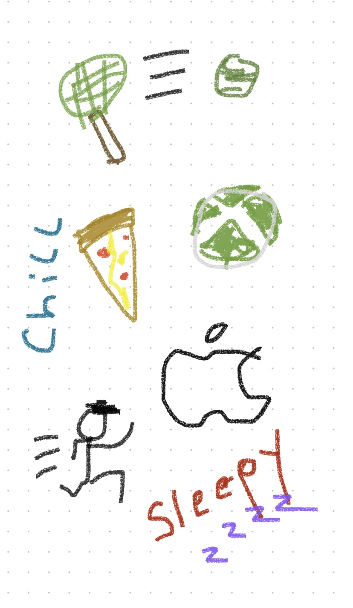

## Sri's Page
### My name is Sri, and I like coding in Python. I am excited to take CSP as I can put my coding skills to the test. Below is my Freeform picture that can describe me.

## This is my favorite Youtuber and one of his videos
<iframe
    width="640"
    height="480"
    src="https://www.youtube.com/embed/guXTAOcrZaY"
    frameborder="0"
    allow="autoplay; encrypted-media"
    allowfullscreen
>
</iframe>

<html>
<head>
    <title>Get To Know Me Game</title>
</head>
<body>
    <h1>Hello. Welcome to the Get To Know Me Game.</h1>
    
This is a multiple choice test that will test your knowledge about me.

    <form id="quizForm">
        

        <button type="button" onclick="checkAnswer()">Submit</button>
    </form>

    
</body>
</html>

## Here are some of my social media profiles:
## [Github](https://github.com/SriS126)  

## [Instagram](https://www.instagram.com/sri__s126/?next=%2F)